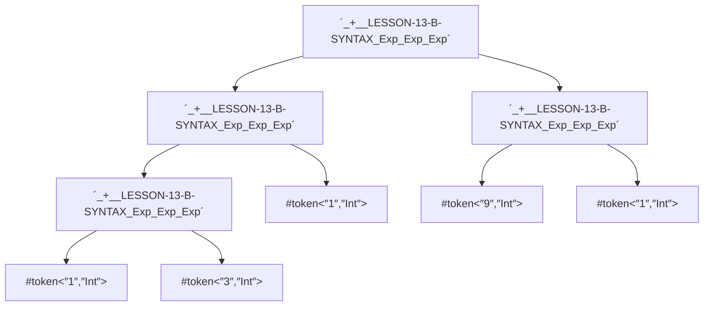
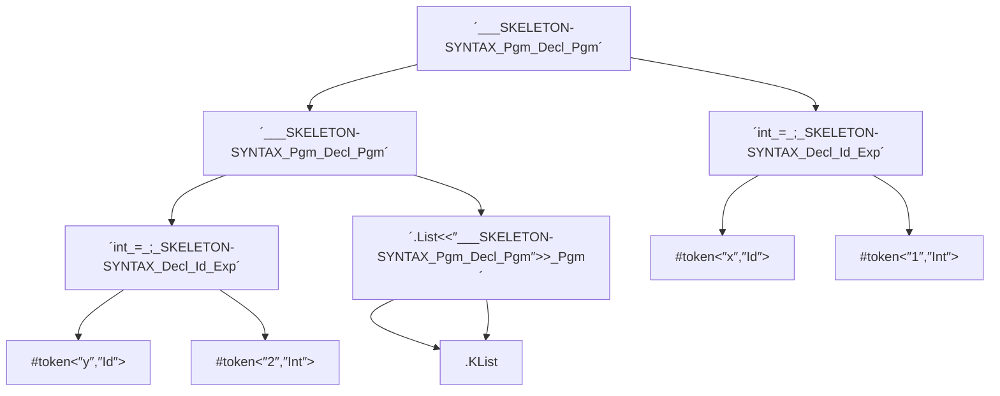

```input
`_+__LESSON-13-B-SYNTAX_Exp_Exp_Exp`(`_+__LESSON-13-B-SYNTAX_Exp_Exp_Exp`(#token("1","Int"),`_+__LESSON-13-B-SYNTAX_Exp_Exp_Exp`(#token("1","Int"),#token("3","Int"))),`_+__LESSON-13-B-SYNTAX_Exp_Exp_Exp`(#token("9","Int"),#token("1","Int")))
```

```k
module AST-DIAGRAM-MERMAID
    imports STRING

    //syntax Backtick ::= "`"
    syntax AstStatementName ::= r"`.+?`" [token]

    //syntax AstStatement ::= AstStatementName
endmodule
```




