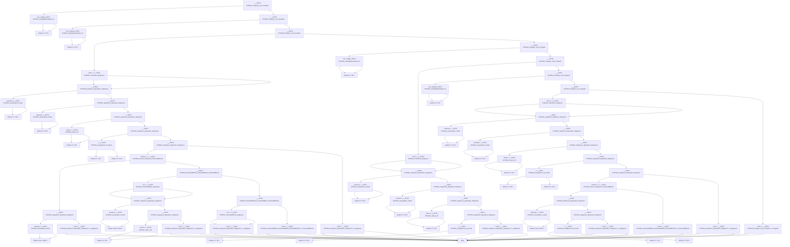

```mermaid
graph TD
        STNT_0[´___XSTS-SYNTAX_Program_Line_Program´]
        STNT_1[´var_:integer_XSTS-SYNTAX_VariableDeclaration_Id´]
        STNT_2[´___XSTS-SYNTAX_Program_Line_Program´]
        STNT_3[´var_:boolean_XSTS-SYNTAX_VariableDeclaration_Id´]
        STNT_4[´___XSTS-SYNTAX_Program_Line_Program´]
        STNT_5[´tran<<_>>_XSTS-SYNTAX_Transition_Sequence´]
        STNT_6[´___XSTS-SYNTAX_Sequence_Operation_Sequence´]
        STNT_7[´assume<_>_XSTS-SYNTAX_Assumption_Literal´]
        STNT_8[´___XSTS-SYNTAX_Sequence_Operation_Sequence´]
        STNT_9[´assume<_>_XSTS-SYNTAX_Assumption_Literal´]
        STNT_10[´___XSTS-SYNTAX_Sequence_Operation_Sequence´]
        STNT_11[´havoc<_>_XSTS-SYNTAX_Havoc_Id´]
        STNT_12[´___XSTS-SYNTAX_Sequence_Operation_Sequence´]
        STNT_13[´_:=__XSTS-SYNTAX_Assignment_Id_Literal´]
        STNT_14[´___XSTS-SYNTAX_Sequence_Operation_Sequence´]
        STNT_15[´choice<<_>>__XSTS-SYNTAX_Choice_Sequence_ChoiceOrBlocks´]
        STNT_16[´___XSTS-SYNTAX_Sequence_Operation_Sequence´]
        STNT_17[´assume<_>_XSTS-SYNTAX_Assumption_Literal´]
        STNT_18[´.List<<″___XSTS-SYNTAX_Sequence_Operation_Sequence″>>_Sequence´]
        STNT_19[´___XSTS-SYNTAX_ChoiceOrBlocks_ChoiceOrBlock_ChoiceOrBlocks´]
        STNT_20[´or<<_>>_XSTS-SYNTAX_ChoiceOrBlock_Sequence´]
        STNT_21[´___XSTS-SYNTAX_Sequence_Operation_Sequence´]
        STNT_22[´assume<_>_XSTS-SYNTAX_Assumption_Literal´]
        STNT_23[´___XSTS-SYNTAX_Sequence_Operation_Sequence´]
        STNT_24[´havoc<_>_XSTS-SYNTAX_Havoc_Id´]
        STNT_25[´.List<<″___XSTS-SYNTAX_Sequence_Operation_Sequence″>>_Sequence´]
        STNT_26[´___XSTS-SYNTAX_ChoiceOrBlocks_ChoiceOrBlock_ChoiceOrBlocks´]
        STNT_27[´or<<_>>_XSTS-SYNTAX_ChoiceOrBlock_Sequence´]
        STNT_28[´.List<<″___XSTS-SYNTAX_Sequence_Operation_Sequence″>>_Sequence´]
        STNT_29[´.List<<″___XSTS-SYNTAX_ChoiceOrBlocks_ChoiceOrBlock_ChoiceOrBlocks″>>_ChoiceOrBlocks´]
        STNT_30[´.List<<″___XSTS-SYNTAX_Sequence_Operation_Sequence″>>_Sequence´]
        STNT_31[´___XSTS-SYNTAX_Program_Line_Program´]
        STNT_32[´var_:integer_XSTS-SYNTAX_VariableDeclaration_Id´]
        STNT_33[´___XSTS-SYNTAX_Program_Line_Program´]
        STNT_34[´tran<<_>>_XSTS-SYNTAX_Transition_Sequence´]
        STNT_35[´___XSTS-SYNTAX_Sequence_Operation_Sequence´]
        STNT_36[´assume<_>_XSTS-SYNTAX_Assumption_Literal´]
        STNT_37[´___XSTS-SYNTAX_Sequence_Operation_Sequence´]
        STNT_38[´assume<_>_XSTS-SYNTAX_Assumption_Literal´]
        STNT_39[´___XSTS-SYNTAX_Sequence_Operation_Sequence´]
        STNT_40[´havoc<_>_XSTS-SYNTAX_Havoc_Id´]
        STNT_41[´___XSTS-SYNTAX_Sequence_Operation_Sequence´]
        STNT_42[´_:=__XSTS-SYNTAX_Assignment_Id_Literal´]
        STNT_43[´.List<<″___XSTS-SYNTAX_Sequence_Operation_Sequence″>>_Sequence´]
        STNT_44[´___XSTS-SYNTAX_Program_Line_Program´]
        STNT_45[´var_:boolean_XSTS-SYNTAX_VariableDeclaration_Id´]
        STNT_46[´___XSTS-SYNTAX_Program_Line_Program´]
        STNT_47[´tran<<_>>_XSTS-SYNTAX_Transition_Sequence´]
        STNT_48[´___XSTS-SYNTAX_Sequence_Operation_Sequence´]
        STNT_49[´assume<_>_XSTS-SYNTAX_Assumption_Literal´]
        STNT_50[´___XSTS-SYNTAX_Sequence_Operation_Sequence´]
        STNT_51[´assume<_>_XSTS-SYNTAX_Assumption_Literal´]
        STNT_52[´___XSTS-SYNTAX_Sequence_Operation_Sequence´]
        STNT_53[´havoc<_>_XSTS-SYNTAX_Havoc_Id´]
        STNT_54[´___XSTS-SYNTAX_Sequence_Operation_Sequence´]
        STNT_55[´_:=__XSTS-SYNTAX_Assignment_Id_Literal´]
        STNT_56[´___XSTS-SYNTAX_Sequence_Operation_Sequence´]
        STNT_57[´choice<<_>>__XSTS-SYNTAX_Choice_Sequence_ChoiceOrBlocks´]
        STNT_58[´___XSTS-SYNTAX_Sequence_Operation_Sequence´]
        STNT_59[´assume<_>_XSTS-SYNTAX_Assumption_Literal´]
        STNT_60[´___XSTS-SYNTAX_Sequence_Operation_Sequence´]
        STNT_61[´_:=__XSTS-SYNTAX_Assignment_Id_Literal´]
        STNT_62[´.List<<″___XSTS-SYNTAX_Sequence_Operation_Sequence″>>_Sequence´]
        STNT_63[´.List<<″___XSTS-SYNTAX_ChoiceOrBlocks_ChoiceOrBlock_ChoiceOrBlocks″>>_ChoiceOrBlocks´]
        STNT_64[´.List<<″___XSTS-SYNTAX_Sequence_Operation_Sequence″>>_Sequence´]
        STNT_65[´.List<<″___XSTS-SYNTAX_Program_Line_Program″>>_Program´]
        TKN_0[#token<″x″,″Id″>]
        TKN_1[#token<″y″,″Id″>]
        TKN_2[#token<″1″,″Int″>]
        TKN_3[#token<″2″,″Int″>]
        TKN_4[#token<″x″,″Id″>]
        TKN_5[#token<″x″,″Id″>]
        TKN_6[#token<″2″,″Int″>]
        TKN_7[#token<″true″,″Bool″>]
        TKN_8[#token<″false″,″Bool″>]
        TKN_9[#token<″y″,″Id″>]
        TKN_10[#token<″z″,″Id″>]
        TKN_11[#token<″1″,″Int″>]
        TKN_12[#token<″2″,″Int″>]
        TKN_13[#token<″x″,″Id″>]
        TKN_14[#token<″x″,″Id″>]
        TKN_15[#token<″2″,″Int″>]
        TKN_16[#token<″a″,″Id″>]
        TKN_17[#token<″1″,″Int″>]
        TKN_18[#token<″2″,″Int″>]
        TKN_19[#token<″x″,″Id″>]
        TKN_20[#token<″x″,″Id″>]
        TKN_21[#token<″2″,″Int″>]
        TKN_22[#token<″true″,″Bool″>]
        TKN_23[#token<″x″,″Id″>]
        TKN_24[#token<″2″,″Int″>]
        STNT_1 --> TKN_0
        STNT_1 --> TKN_0
        STNT_3 --> TKN_1
        STNT_3 --> TKN_1
        STNT_7 --> TKN_2
        STNT_7 --> TKN_2
        STNT_9 --> TKN_3
        STNT_9 --> TKN_3
        STNT_11 --> TKN_4
        STNT_11 --> TKN_4
        STNT_13 --> TKN_5
        STNT_13 --> TKN_6
        STNT_17 --> TKN_7
        STNT_17 --> TKN_7
        STNT_18 --> .KList
        STNT_18 --> .KList
        STNT_16 --> STNT_17
        STNT_16 --> STNT_18
        STNT_22 --> TKN_8
        STNT_22 --> TKN_8
        STNT_24 --> TKN_9
        STNT_24 --> TKN_9
        STNT_25 --> .KList
        STNT_25 --> .KList
        STNT_23 --> STNT_24
        STNT_23 --> STNT_25
        STNT_21 --> STNT_22
        STNT_21 --> STNT_23
        STNT_20 --> STNT_21
        STNT_20 --> STNT_21
        STNT_28 --> .KList
        STNT_28 --> .KList
        STNT_27 --> STNT_28
        STNT_27 --> STNT_28
        STNT_29 --> .KList
        STNT_29 --> .KList
        STNT_26 --> STNT_27
        STNT_26 --> STNT_29
        STNT_19 --> STNT_20
        STNT_19 --> STNT_26
        STNT_15 --> STNT_16
        STNT_15 --> STNT_19
        STNT_30 --> .KList
        STNT_30 --> .KList
        STNT_14 --> STNT_15
        STNT_14 --> STNT_30
        STNT_12 --> STNT_13
        STNT_12 --> STNT_14
        STNT_10 --> STNT_11
        STNT_10 --> STNT_12
        STNT_8 --> STNT_9
        STNT_8 --> STNT_10
        STNT_6 --> STNT_7
        STNT_6 --> STNT_8
        STNT_5 --> STNT_6
        STNT_5 --> STNT_6
        STNT_32 --> TKN_10
        STNT_32 --> TKN_10
        STNT_36 --> TKN_11
        STNT_36 --> TKN_11
        STNT_38 --> TKN_12
        STNT_38 --> TKN_12
        STNT_40 --> TKN_13
        STNT_40 --> TKN_13
        STNT_42 --> TKN_14
        STNT_42 --> TKN_15
        STNT_43 --> .KList
        STNT_43 --> .KList
        STNT_41 --> STNT_42
        STNT_41 --> STNT_43
        STNT_39 --> STNT_40
        STNT_39 --> STNT_41
        STNT_37 --> STNT_38
        STNT_37 --> STNT_39
        STNT_35 --> STNT_36
        STNT_35 --> STNT_37
        STNT_34 --> STNT_35
        STNT_34 --> STNT_35
        STNT_45 --> TKN_16
        STNT_45 --> TKN_16
        STNT_49 --> TKN_17
        STNT_49 --> TKN_17
        STNT_51 --> TKN_18
        STNT_51 --> TKN_18
        STNT_53 --> TKN_19
        STNT_53 --> TKN_19
        STNT_55 --> TKN_20
        STNT_55 --> TKN_21
        STNT_59 --> TKN_22
        STNT_59 --> TKN_22
        STNT_61 --> TKN_23
        STNT_61 --> TKN_24
        STNT_62 --> .KList
        STNT_62 --> .KList
        STNT_60 --> STNT_61
        STNT_60 --> STNT_62
        STNT_58 --> STNT_59
        STNT_58 --> STNT_60
        STNT_63 --> .KList
        STNT_63 --> .KList
        STNT_57 --> STNT_58
        STNT_57 --> STNT_63
        STNT_64 --> .KList
        STNT_64 --> .KList
        STNT_56 --> STNT_57
        STNT_56 --> STNT_64
        STNT_54 --> STNT_55
        STNT_54 --> STNT_56
        STNT_52 --> STNT_53
        STNT_52 --> STNT_54
        STNT_50 --> STNT_51
        STNT_50 --> STNT_52
        STNT_48 --> STNT_49
        STNT_48 --> STNT_50
        STNT_47 --> STNT_48
        STNT_47 --> STNT_48
        STNT_65 --> .KList
        STNT_65 --> .KList
        STNT_46 --> STNT_47
        STNT_46 --> STNT_65
        STNT_44 --> STNT_45
        STNT_44 --> STNT_46
        STNT_33 --> STNT_34
        STNT_33 --> STNT_44
        STNT_31 --> STNT_32
        STNT_31 --> STNT_33
        STNT_4 --> STNT_5
        STNT_4 --> STNT_31
        STNT_2 --> STNT_3
        STNT_2 --> STNT_4
        STNT_0 --> STNT_1
        STNT_0 --> STNT_2
```