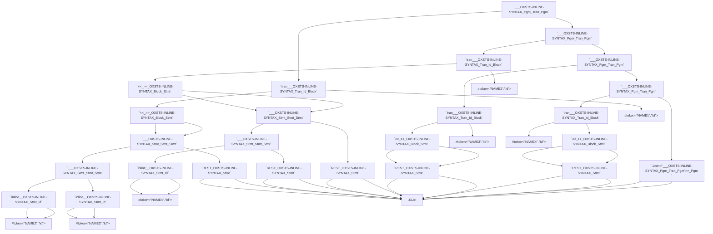

```mermaid
graph TD
        STNT_0[´___OXSTS-INLINE-SYNTAX_Pgm_Tran_Pgm´]
        STNT_1[´tran___OXSTS-INLINE-SYNTAX_Tran_Id_Block´]
        STNT_2[´<<_>>_OXSTS-INLINE-SYNTAX_Block_Stmt´]
        STNT_3[´___OXSTS-INLINE-SYNTAX_Stmt_Stmt_Stmt´]
        STNT_4[´___OXSTS-INLINE-SYNTAX_Stmt_Stmt_Stmt´]
        STNT_5[´inline__OXSTS-INLINE-SYNTAX_Stmt_Id´]
        STNT_6[´inline__OXSTS-INLINE-SYNTAX_Stmt_Id´]
        STNT_7[´REST_OXSTS-INLINE-SYNTAX_Stmt´]
        STNT_8[´___OXSTS-INLINE-SYNTAX_Pgm_Tran_Pgm´]
        STNT_9[´tran___OXSTS-INLINE-SYNTAX_Tran_Id_Block´]
        STNT_10[´<<_>>_OXSTS-INLINE-SYNTAX_Block_Stmt´]
        STNT_11[´___OXSTS-INLINE-SYNTAX_Stmt_Stmt_Stmt´]
        STNT_12[´___OXSTS-INLINE-SYNTAX_Stmt_Stmt_Stmt´]
        STNT_13[´REST_OXSTS-INLINE-SYNTAX_Stmt´]
        STNT_14[´inline__OXSTS-INLINE-SYNTAX_Stmt_Id´]
        STNT_15[´REST_OXSTS-INLINE-SYNTAX_Stmt´]
        STNT_16[´___OXSTS-INLINE-SYNTAX_Pgm_Tran_Pgm´]
        STNT_17[´tran___OXSTS-INLINE-SYNTAX_Tran_Id_Block´]
        STNT_18[´<<_>>_OXSTS-INLINE-SYNTAX_Block_Stmt´]
        STNT_19[´REST_OXSTS-INLINE-SYNTAX_Stmt´]
        STNT_20[´___OXSTS-INLINE-SYNTAX_Pgm_Tran_Pgm´]
        STNT_21[´tran___OXSTS-INLINE-SYNTAX_Tran_Id_Block´]
        STNT_22[´<<_>>_OXSTS-INLINE-SYNTAX_Block_Stmt´]
        STNT_23[´REST_OXSTS-INLINE-SYNTAX_Stmt´]
        STNT_24[´.List<<″___OXSTS-INLINE-SYNTAX_Pgm_Tran_Pgm″>>_Pgm´]
        TKN_0[#token<″NAME1″,″Id″>]
        TKN_1[#token<″NAME2″,″Id″>]
        TKN_2[#token<″NAME3″,″Id″>]
        TKN_3[#token<″NAME2″,″Id″>]
        TKN_4[#token<″NAME4″,″Id″>]
        TKN_5[#token<″NAME3″,″Id″>]
        TKN_6[#token<″NAME4″,″Id″>]
        STNT_5 --> TKN_1
        STNT_5 --> TKN_1
        STNT_6 --> TKN_2
        STNT_6 --> TKN_2
        STNT_4 --> STNT_5
        STNT_4 --> STNT_6
        STNT_7 --> .KList
        STNT_7 --> .KList
        STNT_3 --> STNT_4
        STNT_3 --> STNT_7
        STNT_2 --> STNT_3
        STNT_2 --> STNT_3
        STNT_1 --> TKN_0
        STNT_1 --> STNT_2
        STNT_13 --> .KList
        STNT_13 --> .KList
        STNT_14 --> TKN_4
        STNT_14 --> TKN_4
        STNT_12 --> STNT_13
        STNT_12 --> STNT_14
        STNT_15 --> .KList
        STNT_15 --> .KList
        STNT_11 --> STNT_12
        STNT_11 --> STNT_15
        STNT_10 --> STNT_11
        STNT_10 --> STNT_11
        STNT_9 --> TKN_3
        STNT_9 --> STNT_10
        STNT_19 --> .KList
        STNT_19 --> .KList
        STNT_18 --> STNT_19
        STNT_18 --> STNT_19
        STNT_17 --> TKN_5
        STNT_17 --> STNT_18
        STNT_23 --> .KList
        STNT_23 --> .KList
        STNT_22 --> STNT_23
        STNT_22 --> STNT_23
        STNT_21 --> TKN_6
        STNT_21 --> STNT_22
        STNT_24 --> .KList
        STNT_24 --> .KList
        STNT_20 --> STNT_21
        STNT_20 --> STNT_24
        STNT_16 --> STNT_17
        STNT_16 --> STNT_20
        STNT_8 --> STNT_9
        STNT_8 --> STNT_16
        STNT_0 --> STNT_1
        STNT_0 --> STNT_8
```